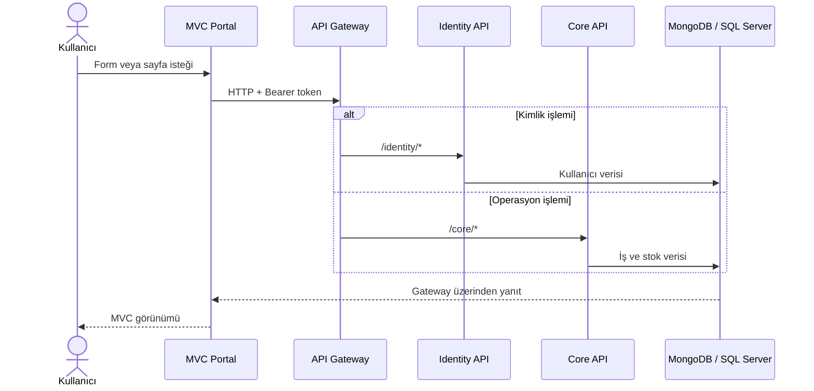

# Mimari ve katmanlar

## Mimari yaklaşım

KitRental; ayrı Identity servisi, modüler monolith Core API, merkezi Gateway ve tek MVC kullanıcı arayüzünden oluşur. Core içindeki iş alanları aynı süreç ve veritabanı sınırında tutulur; domain, application, infrastructure ve API bağımlılıkları ayrılmıştır.

Mevcut uygulama durumu:

- Hedef framework `net10.0`; nullable reference types ve implicit usings açıktır.
- Derleyici uyarıları hata kabul edilir (`TreatWarningsAsErrors=true`).
- Core operasyon verisi SQL Server'da, Identity kullanıcı verisi MongoDB'de saklanır.
- Test ortamında aynı port ve dış servis bağımlılıklarına ihtiyaç duymayan bellek içi repository adaptörleri kullanılır.
- API sözleşmeleri Minimal API ile, web arayüzü ASP.NET Core MVC ile sunulur.
- Swagger dokümanları Gateway, Identity ve Core uygulamalarında mevcuttur.
- Gateway şu anda YARP paketi kullanmaz; header, body, query string ve yanıtı taşıyan `HttpClient` tabanlı bir reverse proxy uygular.
- RabbitMQ, Redis ve Reporting API henüz çalışma zamanına bağlı değildir. `KitRental.Contracts` içindeki event tipleri gelecek entegrasyonlar için sözleşme hazırlığıdır.

## İstek akışı

## Çözüm projeleri

### KitRental.BuildingBlocks

Servisler arası tekrar kullanılabilir, iş alanından bağımsız yapı taşlarını içerir.

| Proje | Amaç |
|---|---|
| `KitRental.SharedKernel` | Kodlu `DomainException` temel hata modeli |
| `KitRental.Security` | PBKDF2 parola hashleme, HS256 token üretme/doğrulama, claim yardımcıları |
| `KitRental.Observability` | Health check kaydı ve `X-Correlation-ID` taşıyan istek kapsamı |
| `KitRental.Contracts` | Kargo, kiralama, arıza ve bildirim için gelecekte yayımlanabilecek integration event kayıtları |

BuildingBlocks iş modüllerine veya veri erişim projelerine bağımlı değildir.

### KitRental.Identity

| Katman | Sorumluluk |
|---|---|
| `Identity.Domain` | `UserAccount`, kullanıcı rolleri ve kullanıcı invariant'ları |
| `Identity.Application` | Login, kullanıcı oluşturma/listeleme use-case'leri ve `IUserRepository` portu |
| `Identity.Infrastructure` | MongoDB ve test amaçlı in-memory repository adaptörleri; başlangıç veri/index kurulumu |
| `Identity.Api` | HTTP sözleşmesi, DI, Swagger, authentication/authorization ve problem yanıtları |

### KitRental.Core

| Katman | Sorumluluk |
|---|---|
| `Core.Domain` | Entity, value object, durum makinesi ve domain invariant'ları |
| `Core.Application` | Use-case orkestrasyonu, DTO/command'lar, müşteri kapsam kontrolü ve `ICoreRepository` portu |
| `Core.Infrastructure` | EF Core/SQL Server eşlemeleri, migration, demo veri ve in-memory test adaptörü |
| `Core.Api` | Minimal API endpoint'leri, rol politikaları, Swagger ve RFC 9457 uyumlu hata dönüşümü |

Bağımlılık yönü `Api -> Application -> Domain` şeklindedir. Infrastructure, Application portunu uygular ve API tarafından composition root içinde bağlanır. Domain, EF Core veya HTTP katmanını bilmez.

### KitRental.Gateway

Tek dış API giriş noktasıdır. `/identity/{**path}` isteklerini Identity API'ye, `/core/{**path}` isteklerini Core API'ye taşır. Yetkilendirme kararı downstream servistedir; Gateway Bearer header'ını değiştirmeden iletir. Merkezi Swagger ekranı üç OpenAPI belgesini listeler.

### KitRental.Web

Sunucu taraflı MVC portalıdır. Kullanıcı login olduğunda Identity token'ı şifreli authentication cookie ticket'ında `access_token` olarak saklanır. `KitRentalApiClient`, bu token'ı downstream çağrılara Bearer olarak ekler. Controller üzerindeki rol kontrolleri kullanıcı deneyimi için ilk bariyerdir; asıl güvenlik kontrolü API'de tekrar uygulanır.

## Core iş modülleri

| Modül | Temel modeller | Başlıca servis |
|---|---|---|
| Katalog ve envanter | `ProductModel`, `ProductUnit`, `InventoryEvent` | `InventoryService` |
| Atölye ve depo | `Component`, `StorageLocation`, `ComponentStock`, `StockMovement` | `WorkshopService` |
| Üretim | `BillOfMaterials`, `BillOfMaterialsLine` | `WorkshopService` |
| Müşteri ve sipariş | `Customer`, `RentalOrder` | `OperationsService`, `CustomerPortalService` |
| Kiralama | `RentalPeriod`, `RentalAssignment` | `RentalAssignmentService`, `PhysicalKitService` |
| Lojistik | `Shipment`, `ShipmentEvent` | `OperationsService` |
| Teknik servis | `FaultTicket`, `FaultStatusEvent` | `OperationsService`, `CustomerPortalService` |
| İade | `ReturnInspection`, `InspectionItem` | `OperationsService` |
| Raporlama | `AuditEntry` | `ReportingService` |

## Tasarım ilkeleri

- Ürün modeli ile seri numaralı fiziksel kit birbirinden ayrıdır.
- Sipariş teslimat adresi müşteri adresinden snapshot alınır; sonraki adres değişiklikleri geçmiş siparişi değiştirmez.
- Stok hareketleri geçmiş kaydıdır; raf bakiyesi bu hareketlerle atomik güncellenir.
- Kiralama çakışması repository seviyesinde atomik rezervasyon işlemiyle engellenir.
- Entity durumları doğrudan controller tarafından set edilmez; domain davranışları üzerinden değiştirilir.
- Mutasyonlar aktör kimliği ve zamanla audit kaydı üretir.

