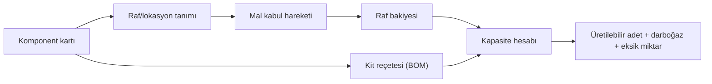
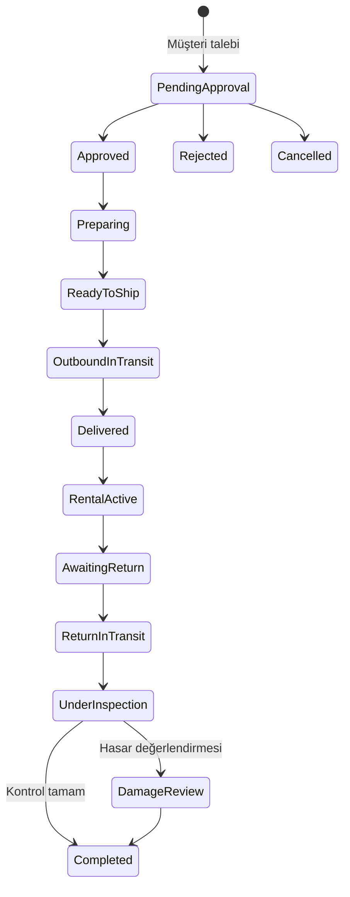
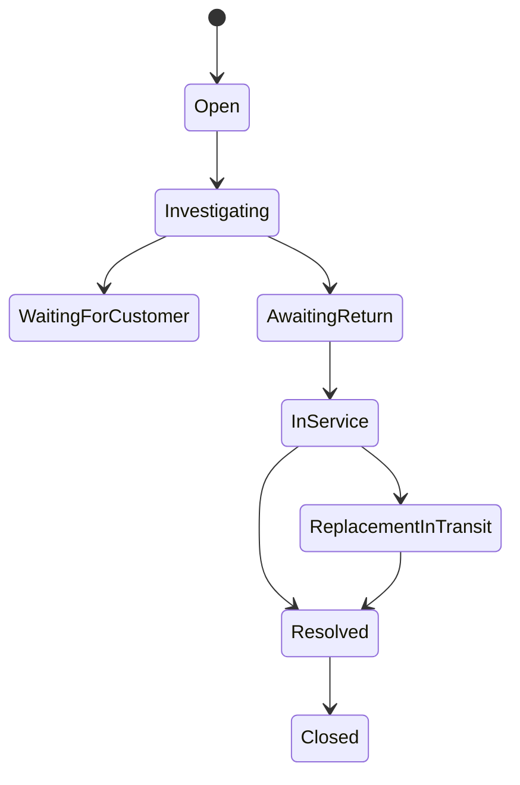

# İş akışları ve durum modelleri

## Komponentten üretilebilir kite



Her kit için hesap:

```text
komponent kapasitesi = floor(tüm raflardaki miktar / reçetedeki ihtiyaç)
üretilebilir kit     = min(tüm komponent kapasiteleri)
```

Minimum kapasiteye sahip satırlar darboğazdır. `bir sonraki kit ihtiyacı - mevcut stok` pozitifse eksik miktarı verir.

## Stok yaşam döngüsü

Stok bakiyesi yalnız hareketler üzerinden değişir:

- `Receipt`: tedarik/mal kabulü.
- `Consumption`: kit üretimi veya atölye kullanımı.
- `TransferOut` ve `TransferIn`: iki raf arasında bağlantılı taşıma.
- `AdjustmentIncrease` ve `AdjustmentDecrease`: modelde desteklenen sayım düzeltme tipleri; mevcut API'de doğrudan endpoint henüz yoktur.

Transfer iki hareketi aynı `TransferId` ile bağlar. Negatif bakiye ve aynı lokasyona transfer reddedilir.

## Sipariş ve kiralama yaşam döngüsü



Domain ayrıca `DeliveryIssue` ve `Overdue` durumlarını taşır. Geçerli geçişler `RentalOrder` davranışları tarafından kontrol edilir; API doğrudan durum alanını değiştirmez.

## Fiziksel kit durumu

```text
Available -> Reserved -> Preparing -> OutboundInTransit -> WithCustomer
WithCustomer -> ReturnInTransit -> UnderInspection
UnderInspection -> Available | InMaintenance | Quarantined | Retired
```

Model ayrıca `Lost` durumunu destekler. Her değişiklik `InventoryEvent` geçmişine aktör, zaman ve açıklamayla eklenir.

## Rezervasyon kuralı

Aynı seri numaralı kit, tarih aralıkları çakışan iki aktif assignment'a atanamaz. Kapalı/iptal edilmiş assignment'lar müsaitlik hesabından dışlanır. Kontrol ve kayıt repository seviyesinde tek kritik işlem olarak yürütülür; yalnız önce kontrol edip sonra insert yapan yarış koşulundan kaçınılır.

## Kargo otomasyonu

| Kargo | `Delivered` etkisi |
|---|---|
| `Outbound` | Sipariş teslim edilir ve kiralama aktifleşir; kit `WithCustomer` olur. |
| `Return` | Sipariş iade kabul/incelemeye, kit `UnderInspection` durumuna geçer. |
| Replacement türleri | Arıza/değişim kargo geçmişinde izlenir; ayrıntılı otomasyon genişletilebilir. |

Kargo durumları: `Created`, `InTransit`, `Delivered`, `DeliveryIssue`, `Cancelled`.

## Arıza ve teknik servis



Arıza önemleri `Low`, `Medium`, `High`, `Critical` değerleridir. Her durum değişimi önceki/yeni durum, aktör, zaman ve açıklama notuyla saklanır. Müşteri yalnız kendi assignment'ı için arıza oluşturabilir.

## İade kontrolü

Depo görevlisi kontrol maddelerini eksik/hasarlı işaretleri ve notlarla kaydeder, varsa hasar bedeli girer ve fiziksel kit sonucunu seçer. İşlem:

1. Sipariş ve fiziksel kiti doğrular.
2. Değiştirilemez kontrol kaydı oluşturur.
3. Fiziksel kit durumunu sonuca göre günceller.
4. Siparişi tamamlar.
5. Audit kaydı üretir.

## Müşteri veri izolasyonu

Identity kullanıcısındaki `CustomerId`, token'a `customer_id` olarak yazılır. Core bu claim'i:

- portal özetini filtrelemek,
- sipariş listelemek,
- başka müşteri adına sipariş oluşturmayı engellemek,
- arıza/assignment sahipliğini doğrulamak

için kullanır. UI filtresi güvenlik sınırı değildir; kontroller Application/API tarafında tekrarlanır.

