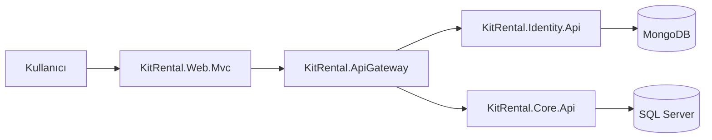

# KitRental teknik dokümantasyonu

Bu dizin, çalışan kod esas alınarak hazırlanmış yaşayan teknik dokümantasyondur. Yeni bir servis, endpoint, rol veya kalıcılık modeli eklendiğinde ilgili dosya aynı değişiklik kapsamında güncellenmelidir.

| Doküman | Kapsam |
|---|---|
| [Mimari ve katmanlar](01-architecture-and-layers.md) | Sistem sınırları, proje bağımlılıkları ve katman sorumlulukları |
| [Core uygulama servisleri](02-core-services.md) | İş servislerinin amaçları, girdileri, kuralları ve yan etkileri |
| [API ve yetkilendirme](03-api-and-authorization.md) | Gateway rotaları, API uç noktaları, roller ve hata sözleşmesi |
| [Veri ve altyapı](04-data-persistence-and-infrastructure.md) | SQL Server, MongoDB, repository adaptörleri, güvenlik ve gözlemlenebilirlik |
| [İş akışları](05-business-flows.md) | Stok, üretilebilirlik, kiralama, kargo, arıza ve iade yaşam döngüleri |
| [Geliştirme ve operasyon](06-development-and-operations.md) | Yerel çalışma, test, Docker, CI/CD ve operasyon notları |

## Kısa sistem özeti

Sistem .NET 10 üzerinde çalışır. Identity kullanıcı ve token verisinin, Core ise katalog ve operasyon verisinin sahibidir. MVC portal tüm API çağrılarını Gateway üzerinden yapar.

